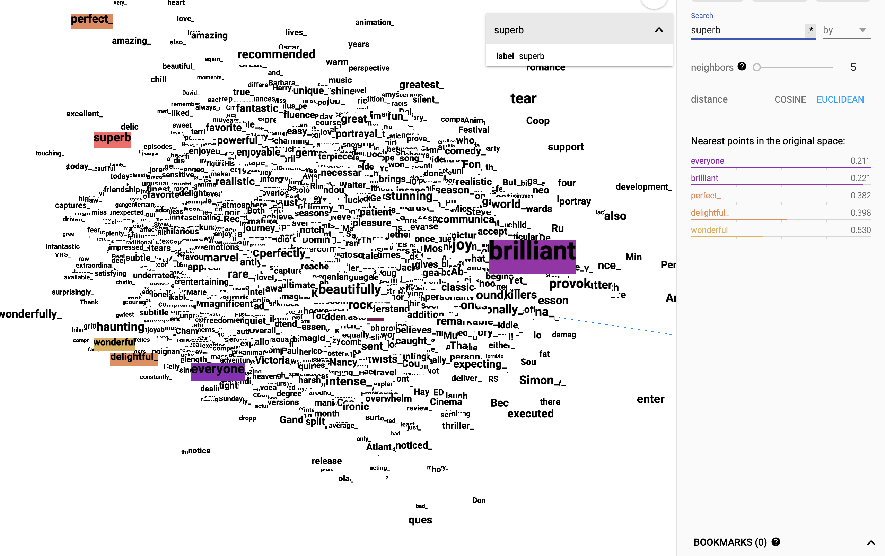
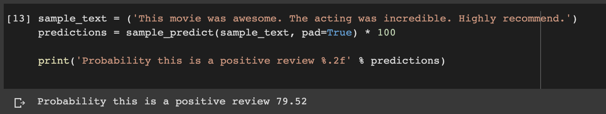

# NLP_with_TF_2.0

Exploring natural language processing with Tensorflow 2.0

These notebooks are based on the "Natural Language Processing with Tensorflow  2
- Beginner's course" that can be found [here](https://www.youtube.com/watch?v=B2q5cRJvqI8), which in turn is based on various
official Tensorflow tutorials. The course consists of three parts: Word
embeddings, sentiment analysis and text generation.

## Word embeddings

The first part deals with word embeddings and is based on [this](https://www.tensorflow.org/tutorials/text/word_embeddings) tutorial.

This is the output of training a simple neural network to do word embeddings. In
the 16-dimensional embedding space the five words closest to 'subperb' in
Euclidean distance are
'perfect', 'birillian', 'wonderful', 'delightful' and 'everyone'. Which sounds
sensible for the most part. Notice that in the image above those words actually
don't appear to be too closely connected at all, but this is due to this being a
projection of the data onto the first three principal components.

## Sentiment analysis

The second part of the course is all about using an RNN for sentiment analysis
and is based on (this)[https://www.tensorflow.org/tutorials/text/text_classification_rnn] tutorial.

The model performs reasonably well.

## Text generation

The third and last part of the course deals with text generation using an RNN.
It is based on [this](https://www.tensorflow.org/tutorials/text/text_generation)
official tensorflow tutorial.

Yeah... this is really deep.